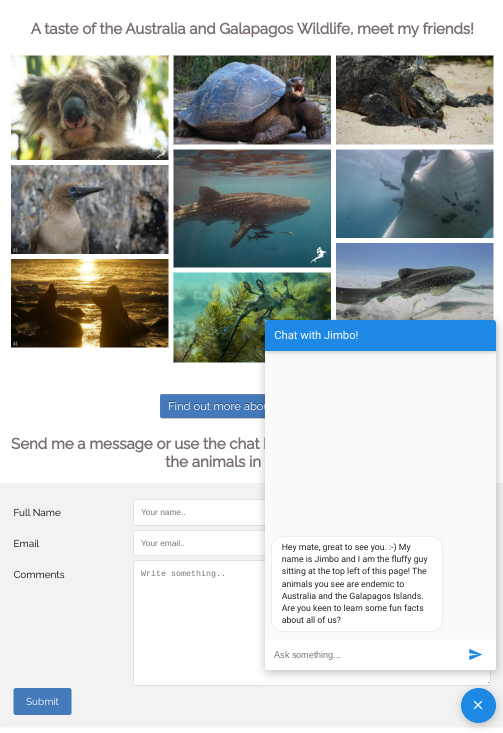

# Photo Gallery App - Getting started with Standalone Components and Google App Engine

In this codelab, you'll build a wildlife photo gallery app with Angular v14 and then you'll deploy it to Google App Engine. 
The completed app will display a set of photos and it will also feature a “send message” form to contact the photographer and a chat window to learn cool facts about the animals pictured in the photos. 

You'll build everything with Angular using Angular v14 and the new standalone components feature.

Here's a preview of the application:

The step-by-step guide can be found at:
https://github.com/angular/standalone-components-photo-gallery-app

A published version of the application running in Google App Engine can be found at:
https://photo-gallery-app-dot-diaologflow-cx-playground.uc.r.appspot.com